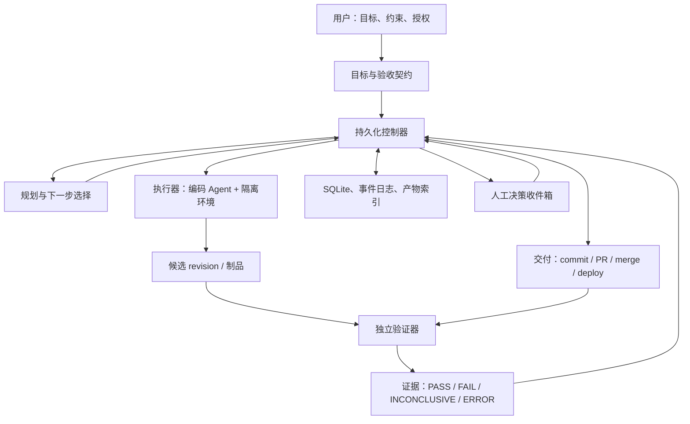

# AI 近全自动开发系统实施计划

> 状态：实施前设计
>
> 工作名称：`DevLoop`
>
> 目标：新建一个独立仓库，持续推进软件开发任务，只有在缺少不可替代的人类方向、授权或判断时才暂停。
>
> 默认运行方式：个人开发者本机运行，先接入现有编码 Agent；后续再扩展到容器、远程执行器和云端调度。

## 1. 目标与边界

这个仓库不是另一个聊天界面，也不是单纯的代码生成器，而是一个**持续开发控制器**：接收用户目标，建立验收标准，调度 Agent 修改代码，独立验证实际结果，自动修复并继续推进，直到交付或确实需要人类决定。

第一版必须证明以下闭环可以在真实项目中运行：

```text
用户目标
→ 验收契约
→ 隔离工作区
→ 编码 Agent
→ 独立验证
→ 自动修复或继续
→ PR
→ 证据与状态持久化
→ 仅在必要时请求人类
```

第一版暂不追求多 Agent 组织、自动生产发布、大规模云端调度、通用长期记忆、跨组织协作和一次性支持所有编码 Agent。

## 2. 第一性原理

软件开发任务可以抽象为：在既定目标、约束、授权和预算内，通过一系列行动把系统从当前状态推进到一个可验证的目标状态。

系统必须分别回答三个问题：

1. **用户要什么？** —— 目标、约束和验收契约。
2. **当前版本实际做到了什么？** —— 受控环境产生的证据。
3. **证据是否足以支持下一步？** —— 确定性门禁和授权策略。

模型负责理解、规划、编码和诊断；普通程序负责状态迁移、权限、预算、证据绑定和交付资格。Agent 的“我完成了”只能作为一项声明，不能直接改变任务状态。

## 3. 总体架构



必须保留三个权力边界：

- **控制器**掌握目标、预算、权限、任务状态和交付资格；
- **执行器**只能在分配的环境中工作，提交候选结果；
- **验证器**针对指定候选版本采集事实，不能被执行器静默修改。

第一版可以将这些模块编译在同一个 Node.js 服务中，不提前拆成微服务。

## 4. 推荐技术基线

除非 Phase 0 发现现有项目约束冲突，默认采用：

- TypeScript；
- Node.js 22；
- pnpm；
- SQLite；
- Git worktree 作为第一种源码隔离方式；
- CLI 作为第一入口；
- 文件系统保存日志和验证产物；
- 适配器接入外部编码 Agent，而不是在本仓库重写模型运行时。

当本地 Shell 隔离不足以支撑目标权限时，再接入容器或虚拟机。Git worktree 只隔离代码目录，不等于完整安全沙箱。

## 5. 仓库结构

```text
DevLoop/
├── apps/
│   └── cli/                  # devctl 命令行入口
├── src/
│   ├── contracts/            # 目标、验收、证据、授权数据结构
│   ├── controller/           # 状态机、调度、恢复、预算
│   ├── planner/              # 目标拆解和下一步选择
│   ├── agents/               # Codex/Claude/其他 Agent 适配器
│   ├── environments/         # worktree、Shell、容器执行环境
│   ├── verification/         # 测试、构建、浏览器、证据采集
│   ├── delivery/             # Git、PR、部署及结果对账
│   ├── policy/               # 权限、预算、人工授权策略
│   ├── storage/              # SQLite、事件日志、产物索引
│   └── recovery/             # 崩溃恢复、超时、幂等对账
├── migrations/
├── tests/
│   ├── unit/
│   ├── integration/
│   ├── recovery/
│   └── fault-injection/
├── docs/
│   ├── architecture/
│   ├── adr/
│   └── runbooks/
└── package.json
```

目录只是初始边界，不要求每个目录一开始都演化成独立框架。

## 6. 核心数据契约

先定义窄接口和版本化数据结构，再实现执行逻辑。

### 6.1 Goal

```text
id
userIntent
constraints
acceptanceContract
authorizationPolicy
budget
status
version
```

### 6.2 WorkItem

```text
id
goalId
description
dependencies
status
attemptCount
```

### 6.3 Attempt / Candidate

```text
Attempt:
  id
  workItemId
  baseRevision
  workspaceId
  agent
  startedAt
  endedAt
  result

Candidate:
  revision
  changedPaths
  artifactDigest
  contractVersion
```

### 6.4 Evidence

```text
requirementId
candidateDigest
checkDefinitionDigest
environmentFingerprint
inputDigest
status
rawArtifactRefs
observedAt
expiresAt
```

### 6.5 GateDecision

```text
candidateDigest
targetAction
policyVersion
evidenceRefs
result: ALLOW | REPAIR | COLLECT | ESCALATE
reasonCodes
```

### 6.6 Operation / HumanRequest

```text
Operation:
  actionId
  idempotencyKey
  exactRevision
  intendedTarget
  externalReceipt
  reconciliationStatus

HumanRequest:
  question
  context
  recommendedOptions
  blockingItems
  requiredAuthority
```

验收契约、验证器定义和授权策略必须独立于 Agent 工作区。Agent 可以修改项目测试，但不能通过删除断言、降低标准或改写门禁获得完成资格。

## 7. 状态机

### 7.1 Goal 状态

```text
DRAFT
  → PLANNING
  → RUNNING
  → VERIFYING
  → DELIVERING
  → SUCCEEDED
```

异常和等待状态：

```text
WAITING_EXTERNAL
WAITING_HUMAN
PAUSED_BUDGET
RECOVERING
FAILED
CLOSED_UNACHIEVABLE
```

### 7.2 状态语义

| 状态 | 含义 | 系统行为 |
|---|---|---|
| `WAITING_EXTERNAL` | CI、限流、网络、异步回调 | 自动退避、轮询、恢复 |
| `WAITING_HUMAN` | 方向、授权、身份或不可替代判断 | 创建具体人工请求 |
| `PAUSED_BUDGET` | 时间、费用、并发或调用额度耗尽 | 保存进度，不能伪装完成 |
| `FAILED` | 当前方案失败，仍可能换方案 | 重新诊断、拆分或切换策略 |
| `CLOSED_UNACHIEVABLE` | 约束经证据证明不可同时满足 | 结束并保留证据 |

某个工作项等待人工时，其他没有依赖关系的工作项继续执行。

## 8. 控制器主循环

每轮执行以下步骤：

```text
1. 读取目标、当前状态和有效证据
2. 检查预算、租约和授权
3. 选择一个可执行且最能推进结果的工作项
4. 创建或恢复隔离工作区
5. 生成本轮有界执行契约
6. 调用 Agent 完成一个步骤
7. 固化候选 revision 和执行日志
8. 运行独立验证器
9. 将证据绑定到当前 revision
10. 根据门禁结果继续、修复、等待或升级
```

规划采用滚动方式：初始阶段确定主要里程碑和依赖，详细展开下一项工作，避免一次生成一份很快过时的巨型计划。

Agent 会话可以更换，任务状态不能依赖聊天上下文。新会话必须从以下内容恢复：当前目标和有效授权、当前代码版本、已验证完成的要求、失败证据和已排除方案、下一步待解决的问题以及剩余预算。

## 9. Agent 适配器

第一版只接入一个编码 Agent，使用窄接口隔离后端差异：

```ts
interface AgentAdapter {
  run(input: AgentRunInput): Promise<AgentRunResult>;
  cancel(runId: string): Promise<void>;
  resume(runId: string, handoff: Handoff): Promise<AgentRunResult>;
}
```

`AgentRunInput` 至少包含：目标、当前工作项、已验证进度、失败证据、可用工具、工作区、预算和明确的本轮完成条件。

每轮结束生成结构化 handoff：

```text
已完成
当前 revision
验证结果
失败原因
已排除方案
未完成事项
下一步建议
```

第一版不让 Agent 递归生成无限子 Agent。并行执行只在工作项确实没有共享写入和数据依赖时启用。

## 10. 工作区与权限

第一版使用 Git worktree 和受限 Shell。后续可把 `EnvironmentAdapter` 替换成容器或虚拟机：

```ts
interface EnvironmentAdapter {
  create(input: WorkspaceInput): Promise<WorkspaceHandle>;
  exec(handle: WorkspaceHandle, command: Command): Promise<ExecResult>;
  snapshot(handle: WorkspaceHandle): Promise<WorkspaceSnapshot>;
  destroy(handle: WorkspaceHandle): Promise<void>;
}
```

权限分为三层：

- **开发权限**：读写工作区、安装依赖、运行测试；
- **交付权限**：push、创建 PR、合并、部署；
- **外部副作用权限**：发送消息、付费、生产变更。

开发 Agent 默认不能访问生产凭据，不能修改控制器数据库、验收契约或授权策略。同一工作区同时只能有一个有效写入者；旧执行器租约失效后，必须先撤销其写入资格再恢复任务。

## 11. 验证器

### 11.1 确定性检查

- 依赖安装；
- 类型检查；
- lint；
- 单元测试；
- 构建；
- 既有回归测试；
- 秘密和危险文件扫描。

### 11.2 实际路径检查

按任务类型启用：浏览器操作、API 调用、数据库状态、文件下载与内容核对、真实启动与健康检查。

### 11.3 语义检查

模型可以辅助进行需求覆盖、文案、视觉和代码风险分析，但模型判断不能覆盖硬性失败、超时、未执行或环境错误。

所有证据必须绑定当前候选版本、验收契约版本、检查定义版本、运行环境和原始产物。

以下结果一律不能算通过：`SKIPPED`、测试超时、运行器错误、依赖缺失、缺少要求的真实路径证据，以及 Agent 自己的文字总结。

## 12. 交付流程

第一版自动推进到 PR：

```text
验证通过
→ 重新计算最新目标分支上的候选
→ 创建 commit
→ 推送分支
→ 创建 PR
→ 保存 PR 编号和 revision
→ 读取 CI 状态
→ CI 失败则回到修复循环
→ 按授权策略合并，否则进入人工收件箱
```

外部动作统一遵循：

```text
记录 CommandIntent
→ 检查权限和前置条件
→ 使用稳定 idempotency key 执行
→ 保存外部回执
→ 查询实际结果
→ 对账后更新状态
```

网络超时后不能直接重复创建 PR、重复部署或重复发送。先查询外部系统，再判断是否需要重试或补偿。

## 13. 人工介入策略

只有以下情况进入人工收件箱：

1. 需要改变产品目标或验收定义；
2. 需要新增权限、凭据、费用或生产范围；
3. 需要 MFA、CAPTCHA 或身份认证；
4. 关键目标无法被证据证明，且授权内的自验证路径已经用尽；
5. 约束互相冲突，需要选择取舍；
6. 连续失败后，所有授权内路径都无法产生新证据。

普通实现细节不明确时，系统采用现有项目约定和最小可逆假设并继续执行。

人工请求必须包含：阻塞项、已经确认的事实、已尝试的方案、推荐选项、各选项影响和需要用户做出的最小决定。授权是持久化策略，不是每一步重复弹窗；当操作超出授权范围或原授权绑定的版本发生实质变化时才重新请求。

## 14. 实施阶段

### Phase 0：架构冻结

产出：README、总体架构、控制面 ADR、证据与完成判定 ADR、人工介入 ADR、数据契约、状态迁移表和技术选型记录。

完成标准：核心不变量和状态转换可以由测试表达。

### Phase 1：持久化控制器

实现 SQLite schema、Goal、WorkItem、Attempt、Evidence、Operation、HumanRequest、append-only 事件日志、状态迁移校验和 CLI 状态查询。

完成标准：进程重启后能恢复任务状态，非法状态迁移会被拒绝。

### Phase 2：本地执行闭环

实现 Git worktree、Shell 执行器、一个 AgentAdapter、本轮预算、执行日志和 handoff 文件。

完成标准：在真实小项目中自动完成一次代码修改并留下候选 revision。

### Phase 3：独立验证器

实现检查命令注册、测试和构建运行、日志与产物保存、revision/环境/契约绑定以及 `PASS / FAIL / INCONCLUSIVE / ERROR` 结果。

完成标准：Agent 声称完成但测试失败时，系统拒绝完成。

### Phase 4：自动修复与恢复

实现失败分类、失败指纹、有限重试、策略切换、连续无进展检测、进程崩溃恢复和外部操作对账。

完成标准：注入崩溃、超时和重复执行后，不丢状态、不重复副作用。

### Phase 5：Git / PR 交付

实现 commit、push、PR 创建、CI 状态读取、目标分支变化后的重新验证和 PR 结果回写。

完成标准：验证的是最新合并候选，而不是过期分支。

### Phase 6：人工收件箱与授权策略

实现 `WAITING_HUMAN`、CLI 查看和回答、授权策略持久化、权限越界检测和方向变更导致的契约版本升级。

完成标准：已授权的低风险动作自动完成，越权动作才请求人类。

### Phase 7：可观测性与界面

实现任务时间线、当前工作项、证据浏览、失败原因、预算消耗、人工请求以及恢复和取消操作。

### Phase 8：并行与远程执行

只有前面稳定后再加入并行无依赖工作项、远程执行器、容器或 VM、多 Agent、自动测试环境部署和生产发布。

## 15. 故障注入验收

必须主动制造以下故障：

| 故障 | 必须表现 |
|---|---|
| Agent 提前声称完成 | 继续验证，不接受自报结果 |
| 测试通过后代码变化 | 旧证据失效，重新验证 |
| Agent 删除断言或跳过测试 | 原验收目标仍未满足 |
| 执行器崩溃 | 恢复到持久状态，不丢工作 |
| 外部动作成功但回执丢失 | 查询并对账，不能盲目重复 |
| PR 创建后进程重启 | 识别既有 PR，继续原操作 |
| 目标分支变化 | 重新生成合并候选并验证 |
| CI 超时 | 等待或标记不确定，不能算通过 |
| 同一失败连续出现 | 识别无进展，切换策略或求助 |
| 某工作项等待人工 | 其他独立工作继续运行 |
| 旧 Agent 租约失效后写入 | 拒绝写入并记录安全事件 |

## 16. MVP 完成定义

给定一个真实 Git 项目和一项小功能，系统可以自主完成：

```text
需求结构化
→ 隔离工作区
→ 编码
→ 测试
→ 失败修复
→ 证据绑定
→ PR 创建
→ 进程重启后恢复
```

并且能够证明：

- 不接受 Agent 自报的完成；
- 不把错误、跳过或超时当作通过；
- 不使用旧版本证据证明新代码；
- 不重复执行已经成功的外部动作；
- 只在真正需要人类时停止。

## 17. 成功指标

第一版运行后持续记录：

- 每个验收完成任务的费用和耗时；
- 每个任务的 Agent 尝试次数；
- 自动修复成功率；
- 崩溃恢复成功率；
- 外部动作重复率；
- 不必要的人工打断次数；
- 错误宣布完成次数；
- 最终交付后发现的需求遗漏数。

系统扩大自主范围的依据，是这些指标和故障注入结果，而不是 Agent 的主观完成率。

## 18. 下一步施工顺序

```text
ADR 与数据契约
→ 状态机及持久化测试
→ 本地执行闭环
→ 独立验证器
→ 恢复和幂等对账
→ Git / PR 交付
→ 人工收件箱
```

完成 Phase 3 之前，不接自动合并和生产部署；完成 Phase 5 之前，不宣称具备端到端自动交付能力。
